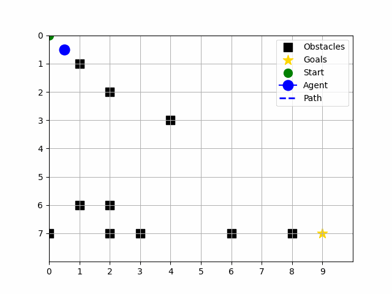

# Autonomous Pathfinding in a GridWorld with Deep Q-Networks (DQN)

This project implements a Reinforcement Learning (RL) approach using Deep Q-Networks (DQN) to navigate an agent through a GridWorld environment. The agent learns to maximize its rewards by reaching specified goals while avoiding obstacles and invalid moves.



## Overview

The GridWorld is a discrete 2D grid environment where the agent starts at a specified position and must reach a goal cell to receive a large positive reward. The agent can move up, down, left, or right. Certain cells contain obstacles that terminate the episode with a penalty if entered. The agent also receives penalties for invalid moves or revisiting previously visited states, encouraging exploration and efficient paths.

By training a DQN, the agent uses a neural network to approximate the Q-value function, learning from its own experiences stored in replay memory. Periodically, a target network is updated to stabilize training. The code supports customizing environment size, start position, goal positions and rewards, obstacles, and hyperparameters for the DQN.

## Features

- **Configurable Environment:** Adjust grid size, start positions, goals, and obstacles through command-line arguments or the `config.py` file.

- **DQN Implementation:** A multi-layered neural network approximates Q-values. Training uses replay memory, target networks, and epsilon-greedy exploration.

- **Flexible Training Parameters:** Modify parameters like the number of episodes, maximum steps per episode, memory size, batch size, learning rate, and epsilon decay.

- **Early Stopping & Model Saving:** The model stops training early if performance thresholds are met. The best model is periodically saved to `best_dqn_model.pkl`.

- **Logging and Visualization:** View real-time training progress with logging. After training, you can plot rewards, losses, and epsilon decay curves, and visualize the agent’s optimal path on the grid.

## Installation

### Clone the Repository:

```bash
git clone https://github.com/neuralsorcerer/rl-gridworld.git
cd rl-gridworld
```

### Create and Activate a Virtual Environment (Optional but recommended):

```bash
python3 -m venv venv
source venv/bin/activate
```

### Install Dependencies:

```bash
pip install -r requirements.txt
```

Ensure you have `numpy`, `matplotlib`, and `pillow` (for animations), and `pytest` or `unittest` for tests:

```bash
pip install numpy matplotlib pillow
```

## Running the Code

### Training

To start training with default parameters:

```bash
python main.py
```

This will train the DQN agent for `EPISODES` (default: 5000) episodes on a default 8x10 grid, starting at (0,0) and with a goal at (4,4).

### Customizing the Environment

You can modify environment parameters using command-line arguments. For example:

```bash
python main.py   --episodes 5000   --rows 8   --cols 10   --start_x 0   --start_y 0   --goal "7 9 50"   --save_animation   --animation_filename optimal_path.gif
```

- `--rows` and `--cols` set the grid size.
- `--start_x` and `--start_y` set the agent's start position.
- `--goal "x y reward"` can be repeated multiple times to add multiple goals.
- `--save_animation` and `--animation_filename` create a GIF of the agent's optimal path after training.

### After Training

Upon completion (or early stopping):

- The best model is saved as `best_dqn_model.pkl` in `models` folder.
- The optimal path is displayed in the console along with its total reward.
- A plot of training progress (rewards, losses, epsilon decay) is shown.
- If requested, an animation of the optimal path is saved as a GIF file.

## Adjusting Hyperparameters

You can modify hyperparameters in `config.py`, such as:

- `EPISODES`: Number of training episodes.
- `LEARNING_RATE`: Learning rate for the neural network.
- `GAMMA`: Discount factor.
- `EPSILON_START`, `EPSILON_DECAY`, `EPSILON_MIN`: Exploration parameters.
- `HIDDEN_LAYERS`: Network architecture.
- `TARGET_UPDATE_FREQ`: Frequency to update the target network.

Changing these values affects convergence speed and policy quality.

## Testing

Run the test suite to verify the correctness of agents, environment, and neural network:

```bash
python -m unittest discover tests
```

If all tests pass, the environment and agent are functioning as intended.

## Troubleshooting and Tips

### Agent Gets Stuck or Produces Non-Optimal Path:

Try removing `best_dqn_model.pkl` before training with new goals or configurations. This ensures training starts fresh.

### Not Reaching the Goal:

Check if the environment is solvable. If solvable, consider adjusting reward structures, training duration, or exploration parameters.

### Performance & Convergence Issues:

Experiment with hyperparameters (e.g., learning rate, exploration decay) or try a different neural network architecture.

## License

This project is provided under the [MIT License](LICENSE).
